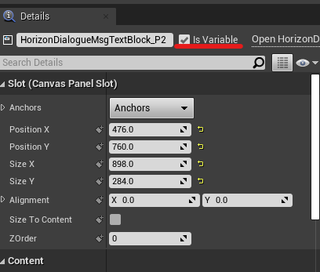

public feed: nuget.org  

Note: 

master branch may be unstable since it is in development, please switch to tags, for example: editor/4.25.0  

----------------------------------------------  
How to Run Demo Project before purchase:(Only for Win64 editor build, no source code)
1. Double click install_game_package_from_nuget_org.cmd, and check if UnrealEditor-*.dll are installed to Binaries\Win64 and Plugins\HorizonDialoguePlugin\Binaries\Win64\
2. Double click HorizonDialogueDemo.uproject  
----------------------------------------------

----------------------------------------------
              HorizonDialoguePlugin
                    5.0.1
         http://dorgon.horizon-studio.net
          	dorgonman@hotmail.com
----------------------------------------------

 The goal of this plugin is to provide a dialogue framework that can easily integrate story telling in your game using blueprint.

-----------------------  
System Requirements
-----------------------  

Supported UnrealEngine version: 4.22-5.0

-----------------------
Installation Guide
-----------------------  

Put HorizonUIPlugin, HorizonTweenPlugin and HorizonDialoguelugin into YOUR_PROJECT/Plugins folder, 
and then add module to your project 
YOUR_PROJECT.Build.cs:
PublicDependencyModuleNames.AddRange(new string[] { "HorizonUI", "HorizonTween", "HorizonFramework", "HorizonDialogue"});

-----------------------
User Guide
-----------------------  

Here is basic process of creating a DialogueScene.

1. Create Dialogue Layout using UserWidget.  
  
  

2. Set widgets that you want to be accessed by DialogueSystem as Variable. 

  
3. Create Blueprint(TestScene_BP) that extends from HorizonDialogueScene and setup defualt widgets for DialogueScene.   
  Note: The widget need set to Variable in step 2 in order to be selectable in drop-down list.

  
4. Add Dialogue Events in TestScene_BP, like following:

  
  
5. Push BP_TestScene using HorizonSceneManger. 

  
  

-----------------------
Technical Details
-----------------------  
Features:  
  
1. Support many DialogueEvent:  

    * WidgetEvents: CreateDialogueMsg, CreateDialogueTalkerNameAndMsg, CreateDialogueMsgWithParam, CreateDialogueMsgWithParamEx, CreateDialogueTextBlock, CreateDialogueImage2D, CreateDialogueUserWidget, CreateDialogueFlipbook, CreateDialogueChoice, CreateDialogueSetWidgetList.  
      
    * ActionEvents: CreateDialogueWaitPendingAction, CreateDialogueWaitDuration, CreateDialogueWaitClick.  
      
    * SceneEvents: CreateDialogueChangeScene, CreateDialoguePopScene, CreateDialoguePushScene.  
      
    * SoundEvents: CreateDialogueSound.  

2. Automatically widget visibility control: Target Widget will visible when DialogueEvent start and hide after finished,  

3. Every DialogueEvent has following callbacks: OnDialogueEventPreStart, OnDialogueEventStart, OnDialogueEventFinished. You can add any custom actions here.

4. Control speed of Auto process or Skip DialogueEvents.  
  
5. DialogueHistoryManager and DialogueHistoryTileView 
 
Code Modules: HorizonDialogue(Runtime), HorizonDialogueEditor(Editor), HorizonFramework(Runtime), HorizonFrameworkEditor(Editor), HorizonTween(Runtime), HorizonUI(Runtime)

Network Replicated: No  

Supported Development Platforms: Win64, Mac, Linux  

Supported Target Build Platforms: All Platforms  

Tested Platform: Win64, Android  

Documentation: https://github.com/dorgonman/HorizonDialogueDemo  

Example Project: https://github.com/dorgonman/HorizonDialogueDemo  

Important/Additional Notes:  
  
This plugin integrated functions of my other plugins, all features and codes in following plugins are included:  
  [HorizonUI](https://www.unrealengine.com/marketplace/en-US/slug/horizon-ui-plugin)  
  [HorizonTween](https://www.unrealengine.com/marketplace/en-US/slug/horizontween-plugin)  
  [HorizonFramework](https://www.unrealengine.com/marketplace/en-US/slug/horizonframework-plugin)  

-----------------------
What does your plugin do/What is the intent of your plugin  
-----------------------  

The intent of this plugin is to provide a framework that can integrate story telling feature in games.  

[DemoVideo](https://www.youtube.com/watch?v=z7MBoe3-o_M)  
[TutorialVideo](https://www.youtube.com/watch?v=hjI2RDx48yc&feature=youtu.be)

-----------------------
Contact and Support
-----------------------  

Email: dorgonman@hotmail.com

Discord: https://discord.gg/surfzAz  

-----------------------
 Version History
-----------------------  
*5.1.0  

* [DialogueQueueComponent] Expose member to protected so it can be modified by it's child

* AB#2647 [DialogueFunctionLibrary] ShouldStopAutoOrSkipEventOnDialogueSceneRemoved for DialogueQueueComponent

*5.0.1   

* [BugFix][WaitDuration] Fix WaitDuration InitProcess not breaking

* [Refactor] Check nullptr before use for some functions

  Update [HorizonUI](https://github.com/dorgonman/HorizonUIPluginDemo) to 5.0.1
    * [BugFix][HorizonDialogueMsgTextBlock] Fix MemoryLeak when parse segmentStr using FXmlFile
    * [New][DialogueMsgTextBlock] Implement SpaceDecorator and Add Tag param to Segment
    * [New][DialogueMsgTextBlock] Add BuildSegment call for Decorator class and rename BuildDecoration to BuildBlockDecoration  

*5.0.0   

* [BugFix] Should call NotifyCustomizationModuleChanged when RegisterCustomClassLayout/UnRegisterCustomClassLayout

  Update [HorizonUI](https://github.com/dorgonman/HorizonUIPluginDemo) to 5.0.0  

  Update [HorizonTween](https://github.com/dorgonman/HorizonTweenDemo) to 5.0.0  

  Update [HorizonFramework](https://github.com/dorgonman/HorizonFrameworkDemo) to 5.0.0 

*4.27.1 

* [BugFix] Fix missing category in HorizonDialogueType

* [BugFix] Fix Sonarqube bug warning

*4.27.0   

* [BugFix] potentially uninitialized local pointer variable 'pOutActor' used

* [New][Event] Implement EventName for all DialogueEventParameter Implementation

* [Refactor] Don't Add to DialogueEventImag if WidgetName is none when CreateDialogueTalkerNameAndMsgWithImage

* [New] Use FHorizonDialogueEventImageParameters for TalkWithImage and TalkWithImageSequence

* [BugFix] Crash if we promote input pin to variable for Custom SGraphNodePin

* [Performance] Implement DECLARE_HORIZONDIALOGUE_QUICK_SCOPE_CYCLE_COUNTER for performance measure

* [Submodule] Source\HorizonUI

* [BugFix] Hotfix Explicit PCH compile error

* [Optimization] Add PrivatePCHHeaderFile to .Build.cs to optimizae build speed

* [Refactor][DialogueQueue] Use DialogueScene to check if we need dequeue instead of SceneManager

* [New][HorizonDialogueQueueComponent] Use Default SceneManager

* [New][HorizonDialogueFunctionLibrary] Implement GetDialogueQueue

* [New] Implement HorizonDialogueQueueComponent with DialogueContext Support

  Update [HorizonUI](https://github.com/dorgonman/HorizonUIPluginDemo) to 4.27.0  

  Update [HorizonTween](https://github.com/dorgonman/HorizonTweenDemo) to 4.27.0  

  Update [HorizonFramework](https://github.com/dorgonman/HorizonFrameworkDemo) to 4.27.0  

*4.26.0   

* [New] Implement HorizonDialogueGraphPanelPinFactory that can show image and text in BP Nodes.  
  
* [New] Implement New DialogueEvents: HorizonDialogueEventDisplayPaper2DActor, HorizonDialogueEventDisplayPaperFlipbookActor, HorizonDialogueEventDisplaySkeletalMeshActor, HorizonDialogueEventDisplayPaperSpriteActor, HorizonDialogueEventSetActorList and HorizonDialogueEventPlayLevelSequence.

* [Refactor] Use RemoveScene instead of PopScene when DialogueEventListFinished

* [BugFix][HorizonDialogueEngine] CreateDialogueMsgWithParam should Check if UserWidget exist

* [Refactor] bAutoEvent, bSkipEvent and Implement FHorizonDialogueDelegates::OnProcessSkipEventNative

* [BugFix][HorizonDialogueEventDisplayChoice] clear ChoiceButtonList before GetWidgetFromName

* [BugFix] FHorizonDialogueDelegates::OnDialogueEventPreStartNative should be called in DialogueEventStart

* [Refactor] Don't need RestartEditor when bEnableHistory now

* [New] Implement GetTargetWidget for Dialogue Events

* [New] Implement FHorizonDialogueDelegates::OnDialogueEventFinished and FHorizonDialogueDelegates::OnChoiceButtonClickedNative

* [Refactor] Remove HorizonDialogueHistoryManager and move functions to HorizonDialogueSystem

* [New] Implement FHorizonDialogueDelegates::OnDialogueEventStartNative for all DialogueEvent

* AB#1675 AB#1109 [New][DialogueEvent] Implement TalkSequence, MsgSequence

* [Refactor][HorizonDialogueFunctionLibrary] SpawnSound should use const FHorizonDialogueEventSoundParameters

* [New] Implement and Refactor SoundSpawnMethod for Dialogue Event

* [New][HorizonDialogueEvent] Implement AddTagUnique, GetTags

* [New][HorizonDialogueEventDisplayChoice] Implement GetChoiceButtonList

* [New][HorizonDialogueEngine] Implement GetCurrentEvent

* [New][HorizonDialogueHistoryI] GetItemObject

* [BugFix][HorizonDialogueEventDisplayChoice] Fix Choice event logic for GoToEventByTag

* [New][HorizonDialogueEngine] Implement GoToEventIndex, GoToEventByTag

* [Refactor][HorizonDialogueHistoryManager] OnDialogueEventPreStart callback implementation adjust

* [Refactor] Coding style

  Update [HorizonUI](https://github.com/dorgonman/HorizonUIPluginDemo) to 4.27.0  

  Update [HorizonTween](https://github.com/dorgonman/HorizonTweenDemo) to 4.27.0  

  Update [HorizonFramework](https://github.com/dorgonman/HorizonFrameworkDemo) to 4.27.0  

*4.25.0   

  Update [HorizonUI](https://github.com/dorgonman/HorizonUIPluginDemo) to 4.25  

  Update [HorizonTween](https://github.com/dorgonman/HorizonTweenDemo) to 4.25  

  Update [HorizonFramework](https://github.com/dorgonman/HorizonFrameworkDemo) to 4.25  

*4.24.0   

  Update [HorizonUI](https://github.com/dorgonman/HorizonUIPluginDemo) to 4.24  

  Update [HorizonTween](https://github.com/dorgonman/HorizonTweenDemo) to 4.24  

  Update [HorizonFramework](https://github.com/dorgonman/HorizonFrameworkDemo) to 4.24  

*4.23.1  

        BugFix: [HorizonDialogueScene] Fix Editor crash  

*4.23.0  

        New: Update to 4.23  

        BugFix: Fix using Flipbook in UHorizonDialogueMsgTextBlock  

*4.22.0  

        NEW: First Version including core features.  