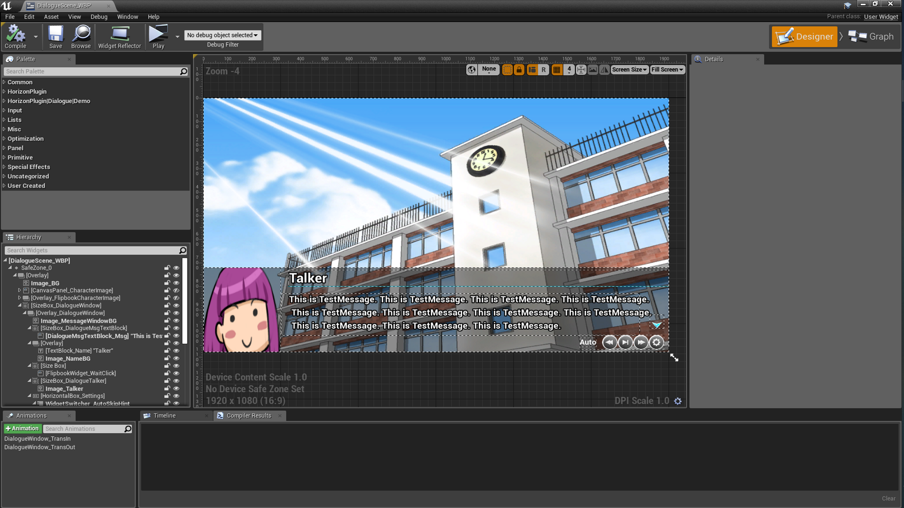
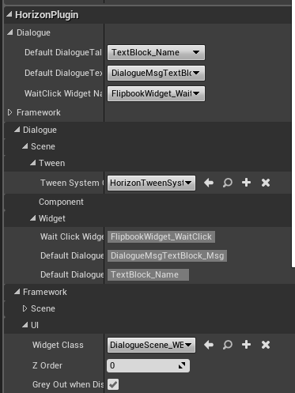
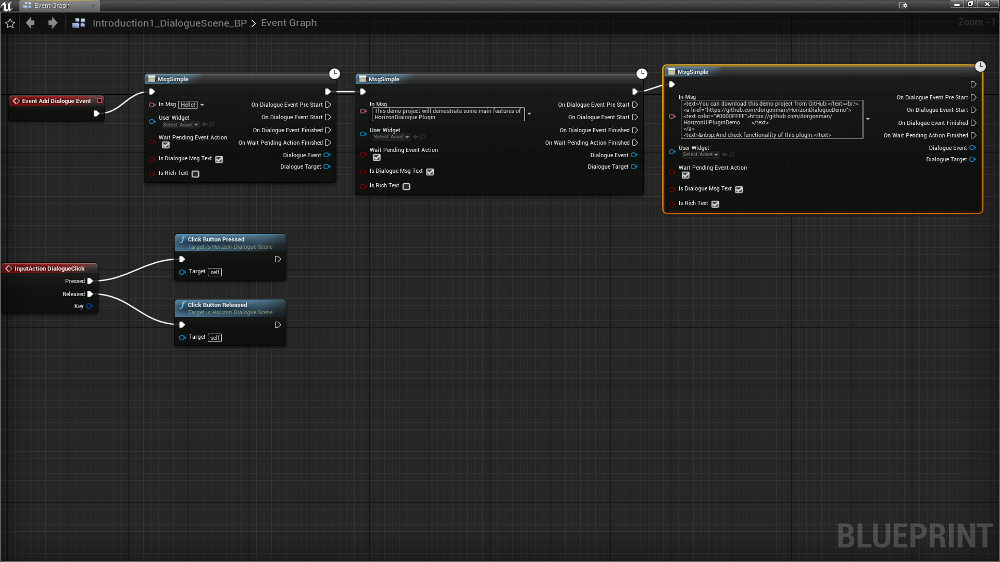
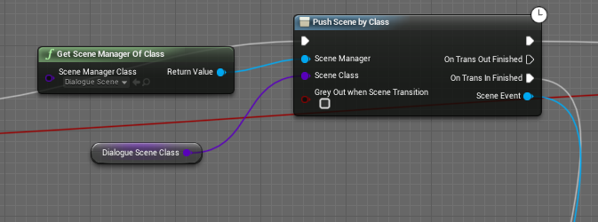

public feed: nuget.org  

private feed(only for internal use): 

Note: 

master branch may be unstable since it is in development, please switch to tags, for example: release/4.22.0  

----------------------------------------------  
How to Run Demo Project before purchase:(Only for Win64 editor build, no source code)
1. [Download nuget executable](https://www.nuget.org/downloads) and copy the exe into C:\Windows\system32\ or any place listed in your PATH environment.  
2. Install [Git for Windows](https://gitforwindows.org/)
3. Double click install_package_from_nuget.org.bat, and check if UE4Editor-*.dll are installed to Binaries\Win64 and Plugins\HorizonDialoguePlugin\Binaries\Win64\
4. Double click HorizonDialogueDemo.uproject  
----------------------------------------------

----------------------------------------------
              HorizonDialoguePlugin
                    4.22.0
         http://dorgon.horizon-studio.net
          	dorgonman@hotmail.com
----------------------------------------------

 The goal of this plugin is to provide a dialogue framework that can easily integrate story telling in your game using blueprint.

-----------------------  
System Requirements
-----------------------  

Supported UnrealEngine version: 4.22

-----------------------
Installation Guide
-----------------------  

Put HorizonUIPlugin, HorizonTweenPlugin and HorizonDialoguelugin into YOUR_PROJECT/Plugins folder, 
and then add module to your project 
YOUR_PROJECT.Build.cs:
PublicDependencyModuleNames.AddRange(new string[] { "HorizonUI", "HorizonTween", "HorizonFramework", "HorizonDialogue"});

-----------------------
User Guide
-----------------------  

Here is basic process of creating a DialogueScene.

1. Create Dialogue Layout using UserWidget.  
  
  
  
2. Create Blueprint(TestScene_BP) that extends from HorizonDialogueScene and setup defualt widgets for DialogueScene.  

  
3. Add Dialogue Events in TestScene_BP, like following:

  
  
4. Push BP_TestScene using HorizonSceneManger. 

  
  

-----------------------
Technical Details
-----------------------  
Features:  
  
1. Support many DialogueEvent:  

    * WidgetEvents: CreateDialogueMsg, CreateDialogueTalkerNameAndMsg, CreateDialogueMsgWithParam, CreateDialogueMsgWithParamEx, CreateDialogueTextBlock, CreateDialogueImage2D, CreateDialogueUserWidget, CreateDialogueFlipbook, CreateDialogueChoice, CreateDialogueSetWidgetList.  
      
    * ActionEvents: CreateDialogueWaitPendingAction, CreateDialogueWaitDuration, CreateDialogueWaitClick.  
      
    * SceneEvents: CreateDialogueChangeScene, CreateDialoguePopScene, CreateDialoguePushScene.  
      
    * SoundEvents: CreateDialogueSound.  

2. Automatically widget visibility control: Target Widget will visible when DialogueEvent start and hide after finished,  

3. Every DialogueEvent has following callbacks: OnDialogueEventPreStart, OnDialogueEventStart, OnDialogueEventFinished. You can add any custom actions here.

4. Control speed of Auto process or Skip DialogueEvents.  
  
5. DialogueHistoryManager and DialogueHistoryTileView 
 
Code Modules: HorizonDialogue(Runtime), HorizonDialogueEditor(Editor), HorizonFramework(Runtime), HorizonFrameworkEditor(Editor), HorizonTween(Runtime), HorizonUI(Runtime)

Number of Blueprints: 0  

Number of C++ Classes: 104  

Network Replicated: No  

Supported Development Platforms: Win64, Mac, Linux  

Supported Target Build Platforms: All Platforms  

Tested Platform: Win64  

Documentation: https://github.com/dorgonman/HorizonDialogueDemo  

Example Project: https://github.com/dorgonman/HorizonDialogueDemo  

Important/Additional Notes:  
  
This plugin integrated functions of my other plugins, all features and codes in following plugins are included:  
  [HorizonUI](https://www.unrealengine.com/marketplace/en-US/slug/horizon-ui-plugin)  
  [HorizonTween](https://www.unrealengine.com/marketplace/en-US/slug/horizontween-plugin)  
  [HorizonFramework](https://www.unrealengine.com/marketplace/en-US/slug/horizonframework-plugin)  

-----------------------
What does your plugin do/What is the intent of your plugin  
-----------------------  

The intent of this plugin is to provide a framework that can integrate story telling feature in games.  

DemoVideo:  https://github.com/dorgonman/HorizonDialogueDemo
TutorialVideo:  https://www.youtube.com/watch?v=hjI2RDx48yc&feature=youtu.be

-----------------------
Contact and Support
-----------------------  

Email: dorgonman@hotmail.com

Discord: https://discord.gg/surfzAz  

-----------------------
 Version History
-----------------------  

*4.22.0  

        NEW: First Version including core features.  